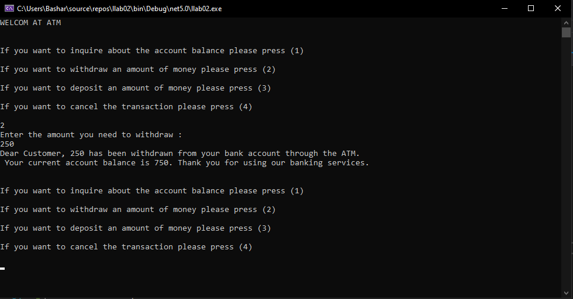

<h1>ATM</h1>

This program isa virtual ATM machine that you can interact with through your computer. It lets you do common banking tasks like checking your account balance, withdrawing money from accounts, and depositing money to your accounts. You'll see a list of options, and you will need to choose the option. Example, if you want to check your balance, you type "1" and it will show you how much money you have in your account $. and If you want to withdraw money, you type "2" and enter the amount you need it. Also, If you want to deposit money, you type "3" and enter the amount you want to add to your account. Finally if you'r want to leave, you type "4" to exit. It's a simple program.

Welcome  

Your Account Balcane  

Withdrawing Money 

Deposting Money  

End Program  

Test Case 
 

